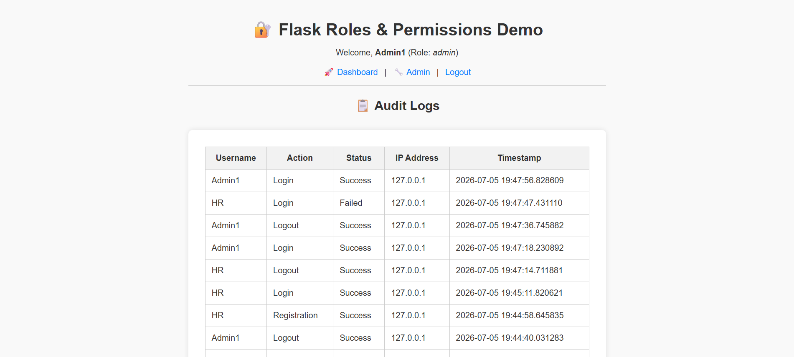

# 🔐 Flask Role-Based Access Control & Audit Logging Demo

A Flask web application that demonstrates **user authentication, role-based access control (RBAC), protected routes, and security audit logging**.

The application uses four organisational roles:

* Admin
* HR
* Finance
* Intern

Users can register, log in, access a protected dashboard, and log out. Administrative pages and security audit logs are restricted to Admin users.

---

## 📌 Project Overview

This project was built to practise practical concepts relevant to entry-level **IT Support, Networking, and Cybersecurity** roles while working toward **CompTIA Security+ and CCNA**.

The application demonstrates how an organisation can:

* Authenticate users
* Assign different user roles
* Restrict sensitive pages
* Apply least-privilege access
* Monitor successful and failed login attempts
* Record user activity for accountability

---

## ✨ Features

* User registration
* Secure password hashing
* User login and logout
* Four organisational roles
* Protected authenticated routes
* Admin-only access controls
* Successful login tracking
* Failed login attempt tracking
* Logout activity tracking
* Registration activity tracking
* IP address recording
* Timestamped security events
* Admin-only audit log page

---

## 👥 User Roles

| Role    | Access                                 |
| ------- | -------------------------------------- |
| Admin   | Dashboard, Admin Panel, and Audit Logs |
| HR      | Authenticated Dashboard                |
| Finance | Authenticated Dashboard                |
| Intern  | Authenticated Dashboard                |

Only users with the **Admin** role can access:

```text
/admin
/audit-logs
```

Non-admin users who attempt to access restricted pages are redirected to the dashboard.

---

## 🛡️ Security Concepts Demonstrated

This project demonstrates:

* Authentication
* Authorization
* Role-Based Access Control (RBAC)
* Least privilege
* Password hashing
* Protected routes
* Security logging
* Failed authentication monitoring
* Accountability
* Administrative access restrictions

---

## 📋 Audit Logging

The application records security-related events including:

| Event                   | Status  |
| ----------------------- | ------- |
| User registration       | Success |
| Correct login           | Success |
| Incorrect login attempt | Failed  |
| User logout             | Success |

Each audit log records:

* Username
* Action
* Status
* IP address
* Timestamp

The audit log page is only accessible to Admin users.

---

## 📸 Screenshots

### Login Page


### Registration Page


### User Dashboard


### Admin Panel


### Admin View


### Security Audit Logs



---

## 🛠️ Tech Stack

* Python
* Flask
* Flask-Login
* Flask-SQLAlchemy
* SQLite
* Werkzeug password hashing
* HTML
* CSS
* Git
* GitHub

---

## 📁 Project Structure

```text
flask_role_app/
│
├── app.py
├── models.py
├── README.md
├── requirements.txt
├── .gitignore
│
├── templates/
│   ├── base.html
│   ├── login.html
│   ├── register.html
│   ├── dashboard.html
│   ├── admin.html
│   └── audit_logs.html
│
├── static/
│   └── screenshots/
│       ├── login.png
│       ├── register.png
│       ├── viewer.png
│       ├── admin.png
│       ├── admin-view.png
│       └── audit-logs.png
│
└── instance/
    └── db.sqlite3
```

The local database, virtual environment, and cache files are excluded from GitHub through `.gitignore`.

---

## 🚀 How to Run the Project Locally

### 1. Clone the repository

```bash
git clone https://github.com/Dark-Willow/flask-role-permissions-app.git
```

### 2. Enter the project folder

```bash
cd flask-role-permissions-app
```

### 3. Install the required packages

```bash
pip install -r requirements.txt
```

### 4. Run the application

```bash
python app.py
```

Alternatively, with `uv`:

```bash
uv run python app.py
```

### 5. Open the application

```text
http://127.0.0.1:5000/login
```

---

## 🌐 Main Routes

| Route         | Purpose                        |
| ------------- | ------------------------------ |
| `/register`   | Create a user account          |
| `/login`      | Authenticate a user            |
| `/dashboard`  | Protected user dashboard       |
| `/admin`      | Admin-only panel               |
| `/audit-logs` | Admin-only security log viewer |
| `/logout`     | End the authenticated session  |

---

## 🧪 Testing Performed

The application was tested to confirm that:

* Users can register successfully
* Correct login credentials are accepted
* Incorrect login attempts are recorded as failed
* Successful logins are recorded
* Logout activity is recorded
* IP addresses and timestamps are stored
* Admin users can view audit logs
* Non-admin users cannot access admin-only pages

---

## 🎯 What I Learned

Through this project, I practised:

* Building an authentication workflow
* Hashing and verifying passwords
* Managing authenticated user sessions
* Assigning organisational roles
* Applying role-based access controls
* Restricting sensitive routes
* Recording successful and failed authentication events
* Creating security audit trails
* Testing access restrictions
* Documenting a technical project on GitHub

---

## ⚠️ Current Security Limitation

The current demonstration allows users to select their own role during registration, including the Admin role.

In a real production environment, public users should never be able to assign themselves elevated privileges.

A future version will:

* Assign new users a safe default role
* Restrict role changes to administrators
* Prevent privilege escalation through registration

---

## 🔮 Future Improvements

* Admin-controlled role assignment
* Separate HR and Finance permissions
* Account lockout after repeated failed login attempts
* Audit log search and filtering
* CSRF protection
* Environment variables for secret configuration
* Improved timestamp formatting
* User management from the Admin Panel
* Public deployment

---

## 📚 Portfolio Purpose

This project is part of my practical portfolio as I work toward:

* CompTIA Security+
* Cisco CCNA

My goal is to build hands-on projects that demonstrate skills relevant to entry-level roles in:

* IT Support
* Service Desk
* Networking
* NOC Operations
* Cybersecurity
* Junior SOC Operations
