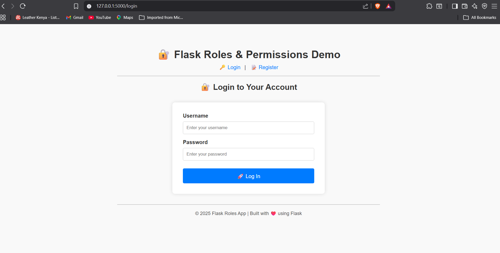
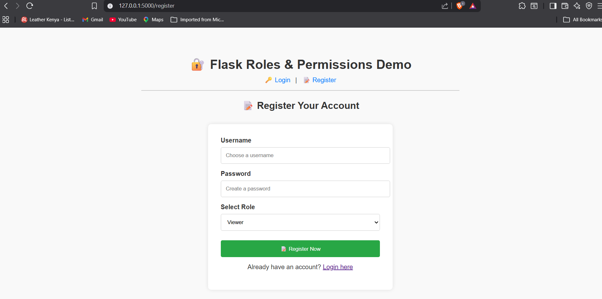
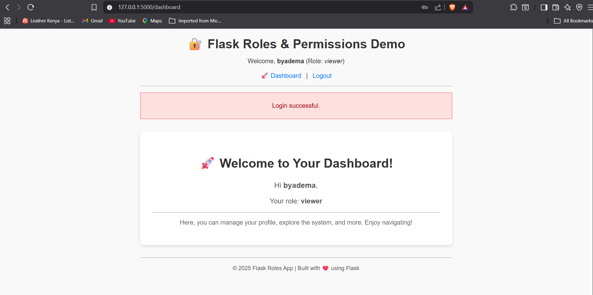
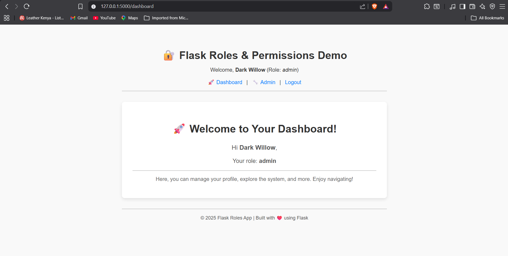
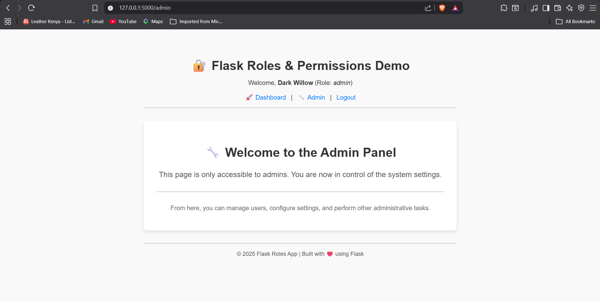

# Flask Roles & Permissions App

A simple Flask web application that demonstrates user authentication and role-based access control.

## Features

* User registration
* User login and logout
* Password hashing
* Role-based dashboard
* Admin-only page
* SQLite database
* Flask-Login authentication
* Flask-SQLAlchemy database integration

## Tech Stack

* Python
* Flask
* Flask-SQLAlchemy
* Flask-Login
* SQLite
* HTML
* CSS

## Project Structure

```text
flask_role_app/
│
├── app.py
├── models.py
├── README.md
├── .gitignore
│
├── templates/
│   ├── base.html
│   ├── login.html
│   ├── register.html
│   ├── dashboard.html
│   └── admin.html
│
├── static/
│
└── instance/
    └── db.sqlite3
```

## How to Run Locally

Install the required packages:

```bash
pip install flask flask-sqlalchemy flask-login
```

Run the application:

```bash
python app.py
```

Then open:

```text
http://127.0.0.1:5000/login
```

## Pages

```text
/register
/login
/dashboard
/admin
```

## Purpose

This project was built as a beginner Flask authentication project to understand user login, registration, role-based permissions, and admin-only page access.

## Screenshots

### Login Page


### Register Page


### Viewer Dashboard


### Admin Dashboard


### Admin View

